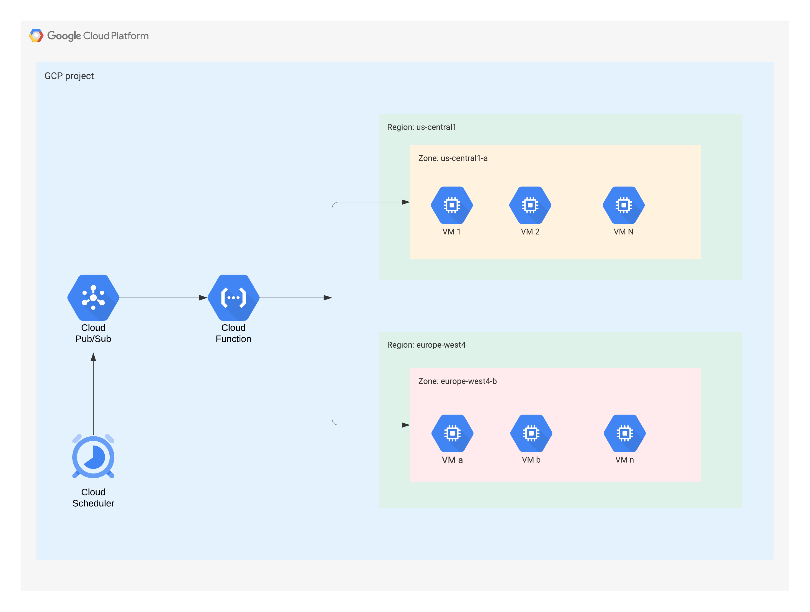

# Overview

Google Compute Engine (GCE) provides [machine-type recommendations](https://cloud.google.com/compute/docs/instances/apply-machine-type-recommendations-for-instances) to customers to optimize their virtual machine (VM) instances. These recommendations are generated automatically based on system metrics gathered by the Cloud Monitoring service over the previous 8 days. At the time of writing, these recommendations *need to be reviewed and applied manually for each virtual machine* in the GCP console.

*This tutorial explains a cost-effective and serverless approach for automating the process of applying machine-type recommendations 
to specific GCE instances*.

The idea is to regularly check if Compute Engine machine-type recommendations are available and apply them to virtual machines that have a specific **label**. Using *labels* allows you to control which virtual machines can be auto-sized automatically based on the GCE recommendations.


In this tutorial, we will make use of the following GCP services:
- Cloud Scheduler
- Pub/Sub
- Cloud Functions (2nd generation)
- Google Compute Engine (GCE)

Below is the architecture diagram of the whole setup: 



# Pre-requisites
- You need a GCP project with billing enabled.

# Tutorial
Before you get started you need to have a few VMs in your GCP project that have machine-type recommendations available. If not, you will create them as part of this tutorial.

**1. Creating GCE instances if they don't already exist**

- In case you have one or more VMs in your GCP project that have machine-type recommendations shown in the UI, 
choose the VMs for which you want to apply the machine-type recommendation automatically by **labeling** them (for example label:autosize=true). Applying labels can be enforced during the creation of the VM instances through Infrastructure-as-Code(IaC).

- If you don't already have VMs with machine-type recommendations, you can create one or more small to medium VMs and let them run "idle" for a while until the machine-type recommendation(s) become visible in the UI.

Let's create two VMs *test-instance-1* and *test-instance-2* in the GCP zone *us-central1-a*, and let's add a label **auto-size=true** only to the *test-instance-1*.

```
gcloud compute instances create test-instance-1 --zone=us-central1-a --machine-type=e2-medium --labels=autosize=true 
```

```
gcloud compute instances create test-instance-2 --zone=us-central1-a --machine-type=e2-medium  
```
  

You will need to let these instances run **idle** for a while until the machine-type recommendations become visible in the GCP Console UI.
  
  
  **2. Create a Pub/Sub topic**

Create a Pub/Sub topic (e.g gce-sizing-recommendations-topic) as follow:
```
gcloud pubsub topics create gce-sizing-recommendations-topic
```
  
 **3. Create a Cloud Scheduler cron job** 
  
Create a cron job that will push a message to the Pub/Sub topic (created above) each time it is triggered.
  ```
    gcloud scheduler jobs create pubsub gce-recommendations-job-2 \
    --location=us-central1 \
    --schedule="0 4 * * *" \
    --topic="gce-sizing-recommendations-topic" \
    --message-body='{"zone":"us-central1-a", "label":"autosize=true"}'
  ```
This cron job will run every day at 4:00am. It has the following message body:
**{"zone":"us-central1-a", "label":"autosize=true"}**

*Note*: you can change the schedule based on your own needs. 


**4. Deploy the Cloud Function (2nd generation)**

- Clone the code of this repo to your machine.
- Navigate to the main directory `cd gce-machine-type-recommendations/`
- Deploy the Cloud Function as follow: 
```
gcloud functions deploy autosizingfct \
       --gen2 \
       --region=europe-west4 \
       --runtime=nodejs14 \
       --entry-point=applySizingRecommendationsFct \
       --trigger-topic=gce-sizing-recommendations-topic
```

*Note*: you may need to increase the timeout of the cloud function above in case you have to apply many GCE machine-type recommendations.

**5. Testing the whole setup**

When machine-type recommendation(s) appears in the GCP console for your labeled VM instance(s), you can trigger the Cloud Scheduler job manually (or wait for it to trigger itself on schedule). Then check if the machine-type recommendation(s) gets applied automatically to all labeled VMs, and that are deployed in the GCP zone configured in the cron job message body.

# Important considerations

- This solution relies on the GCP machine type recommendations. The latter has a [few limitations](https://cloud.google.com/compute/docs/instances/apply-machine-type-recommendations-for-instances#limitations_and_use_cases).
- It should not be used in a *production* GCP environment.
- The scope of this tutorial is standalone VMs only. For GCE instances in a managed instance group, we recommend following GCP [GCP best practices](https://cloud.google.com/compute/docs/instance-groups/apply-machine-type-recommendations-managed-instance-groups).
- Sometimes the GCP machine type recommendation may recommend using a custom machine type. We only considered the standard machine type in this tutorial.


  
